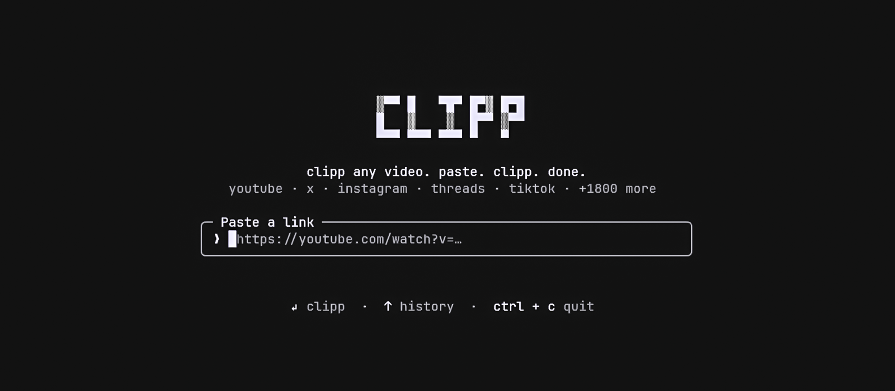
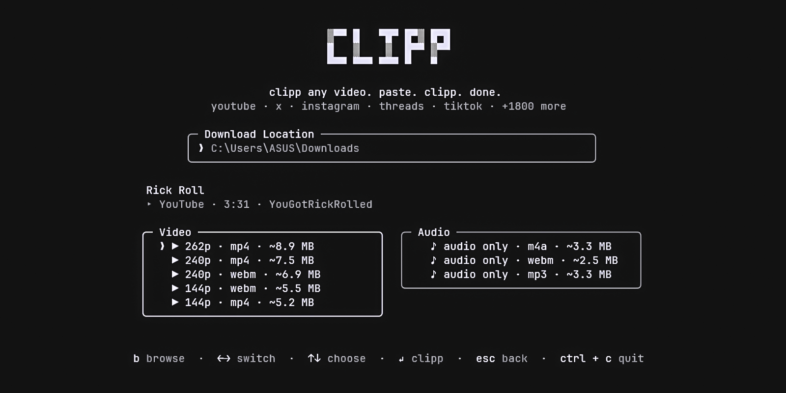

<div align="center">
  
  <h1><b>clipp</b></h1>
  <p><b>clipp any video from YouTube, X, Instagram, Threads & 1800+ sites — right from your terminal.</b></p>
  <p>paste. clipp. done.</p>
</div>

## Install

`clipp` is a Node.js CLI tool. You can run it instantly without installation using `npx`, or install it globally on Windows, Mac, and Linux:

**Install Globally (Windows, Mac, Linux):**
```bash
npm install -g clipp
```

**Run Without Installing:**
```bash
npx clipp
```

## Shortcuts

Bypass the prompt entirely by feeding `clipp` a URL directly:

```bash
# Launch interactively
clipp

# Fetch a URL directly
clipp https://youtu.be/dQw4w9WgXcQ

# Options
clipp -h      # show help
clipp -v      # show version
```

## How it works

When you provide a link, `clipp` takes over the terminal (full-screen, centered — and restores your scrollback on exit). 

Switch between the **Video** and **Audio** panels using `←`/`→`, and pick a specific format using `↑`/`↓` (or `j`/`k`). Want to save it somewhere specific? Press `b` to open your OS's native file manager and choose a target folder. Hit `Enter` to download! 

`esc` goes back, and `^c` quits. Or just use your mouse — the format lists and the footer hints are fully clickable, and clicking the `clipp` logo takes you back home.

<div align="center">
  
</div>

## Features
- **Incredibly Fast**: Just paste a URL and hit Enter.
- **Dual Panels**: Choose cleanly between Video and Audio formats natively.
- **Cross-Platform Folder Picker**: Automatically uses the native, modern folder browser on Windows, Mac, and Linux to pick download locations.
- **Beautiful TUI**: Built with React and Ink.
- **Auto-managed Engine**: Silently fetches and auto-updates its own private, isolated copy of `yt-dlp` — completely immune to local dependency conflicts or outdated global installs.

## Built With
- [React](https://react.dev) + [Ink](https://github.com/vadimdemedes/ink)
- [yt-dlp](https://github.com/yt-dlp/yt-dlp)

## License
This project is [MIT licensed](LICENSE).
